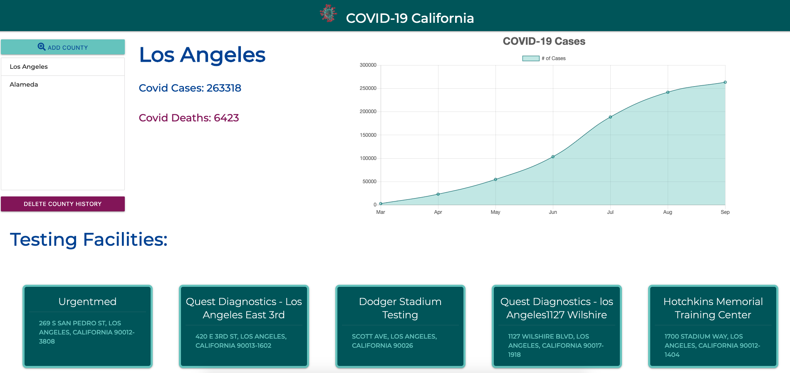

# Covid-CA

Welcome to COVID California!  Hopefully you're staying safe and feeling healthy; and if not, we will help you find a testing facility near you (that is, if you're fortunate enough to be a CA resident).

## Description 

COVID-California is a web application that receives the user’s input of a city or county in California. After the user input is received, the web application will display up-to-date statistics of covid cases and covid deaths in that relevant county, in a chart format. At the bottom of the page, there are local COVID-19 testing facilities that the user can click on to be redirected and get directions to (navigation using Google Maps API).  

## Process

This was a group effort between Aaron Centeno, Laquesha Nance, and Suzanna Akins.  Aaron handled most of the design and responsiveness, while Laquesha and Suzanna focused on using Javascript and jQuery to create function calls and dynamically create elements on the page.

We used GitHub to create issues, separate branches, and push/pull our work. We used Slack and Zoom to communicate and touch base daily on our progress.  

Our planning process was fun.  Aaron created these sketches so we could have a visual idea and understanding of what we wanted our product to look like: .

## Tools

Materialize is our third-party CSS library.  We used two separate APIs to retrieve current data on COVID Cases and locate nearby testing facilities.  

## Try it Out

Here is a preview of our page: 

Try it for yourself! https://aaroncenteno.github.io/covid-ca/
